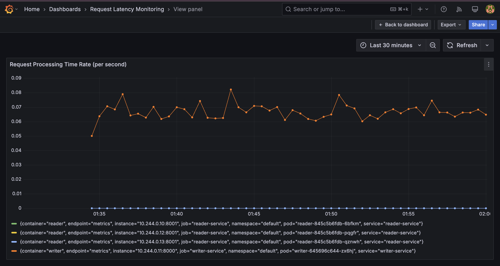

# dyninno-project


> ⚠️ **Security Warning:**  
> This repository contains **hardcoded secrets** in the code. It is strongly recommended to **remove them** and use a **secure secrets management** solution like:
> - AWS Secrets Manager  
> - HashiCorp Vault  


## Table of Contents
- [Overview](#overview)
- [Order Of Execution](#order-of-execution)
- [Secrets](#secrets)
- [Directory Structure](#directory-structure)
- [Mysql Replication](#mysql-replication)
- [Monitoring](#monitoring)
- [License](#license)

## Overview

This is a **complete end-to-end automated platform** where you only need to run the workflows.

- The terraform uses a remote backend (s3 storage), and this is implemented using **Create Remote Backend** workflow.
- **Validate Infra Workflow**: Validates your Terraform scripts.
- **Apply Infra Workflow**: Once validation is complete, it automatically requests approval to proceed with the infrastructure deployment.
- After deployment, you can **log in to the EC2 instance** and run the following command to check the deployed pods:

  ```sh
  kubectl get pods
  ```
- Expected output can be seen below.

  


## Order Of Execution

### Workflow Execution Order

### **Creation Order**
1. **Create Remote Backend** – Set up the Terraform remote backend (e.g., S3 + DynamoDB for state locking).
2. **Validate Infra** – Run `terraform validate` to check for syntax and configuration errors.
3. **Apply Infra** – Execute `terraform apply` to provision the infrastructure.

### **Deletion Order**
1. **Delete Infra** – Run `terraform destroy` to remove all deployed resources.
2. **Destroy Remote Backend** – Delete the remote backend storage (e.g., S3 bucket, DynamoDB table) after ensuring all resources are removed.


## Secrets 

You need to set below secrets at repo level

- AWS_ACCESS_KEY_ID
- AWS_SECRET_ACCESS_KEY
- DOCKER_PASSWORD
- DOCKER_USERNAME
- GH_PAT (Personal Access Token for authentication)

## Directory Structure
```
.
├── README.md
├── app
│   ├── reader
│   │   ├── reader.py
│   │   └── requirements.txt
│   └── writer
│       ├── requirements.txt
│       └── writer.py
├── devops
│   ├── reader.Dockerfile
│   └── writer.Dockerfile
├── manifests
│   ├── monitoring
│   │   └── dashboard
│   │       └── dashboard.json
│   ├── mysql.yaml
│   ├── reader.yaml
│   ├── service-monitor.yaml
│   ├── writer.yaml
│   └── writer.yaml_bkup
├── pictures
│   ├── screenshot.png
│   └── screenshot_1.png
├── remote-backend
│   ├── main.tf
│   ├── terraform.tfvars
│   └── variables.tf
├── scripts
│   ├── install.sh
│   └── install.sh_bkup
└── terraform
    ├── backend.tf
    ├── main.tf
    └── variables.tf

12 directories, 23 files
```

## Mysql Replication

Mysql replication between master and slave is now being taken care automatically (initially it was manual setup). In case you want to cross-check, run below commands.

```sh
kubectl exec -it mysql-master-0 -- mysql -uroot -prootpassword -e "show master status\G;"
```

```sh
kubectl exec -it mysql-slave-0 -- mysql -uroot -prootpassword -e "show slave status\G;"
```

**NOTE:**
```text
The automatic replication works fine, but in case if you restart the writer deployment, 
this replication will break.

```

**FIX:** 
- Get the gtid from master using below command
```sh
kubectl exec -it mysql-master-0 -- mysql -uroot -prootpassword -e "SHOW MASTER  STATUS\G;" | grep -i gtid
```
- Re-sync GTID Position in slave
```sh
kubectl exec -it mysql-slave-0 -- mysql -uroot -prootpassword -e "STOP SLAVE; RESET MASTER; SET @@GLOBAL.GTID_PURGED = '<master's GTID set>'; CHANGE MASTER TO MASTER_AUTO_POSITION = 1; START SLAVE;"
```


## Monitoring
- Run below command in EC2 where your cluster in running
```
kubectl port-forward svc/prometheus-grafana --address 0.0.0.0 3000:80 &
```
- Go to browser and access ```http://<public_ip>:3000```, use below creds

  **User:** admin  
  **Password:** prom-operator 

- Now import the dashboard json located at ```manifests/monitoring/dashboard/dashboard.json``` and you should be able to see graph (like below)

  


## License
NA

© 2025 - All rights reserved.
