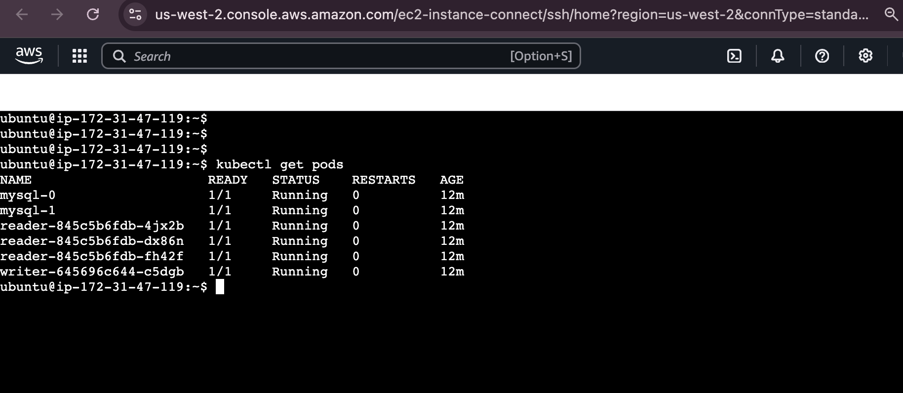

# dyninno-project

## Automated Infrastructure Deployment Platform

This is a **complete end-to-end automated platform** where you only need to run the workflows.

- **Validate Infra Workflow**: Validates your Terraform scripts.
- **Apply Infra Workflow**: Once validation is complete, it automatically requests approval to proceed with the infrastructure deployment.
- After deployment, you can **log in to the EC2 instance** and run the following command to check the deployed pods:

  ```sh
  kubectl get pods
  ```
- Expected output can be seen below.

  


## Secrets you need to set at repo level are below

- AWS_ACCESS_KEY_ID
- AWS_SECRET_ACCESS_KEY
- DOCKER_PASSWORD
- DOCKER_USERNAME
- GH_PAT (Personal Access Token for authentication)

## Directory Structure
```
.
├── README.md
├── app
│   ├── reader
│   │   ├── reader.py
│   │   └── requirements.txt
│   └── writer
│       ├── requirements.txt
│       └── writer.py
├── devops
│   ├── reader.Dockerfile
│   └── writer.Dockerfile
├── manifests
│   ├── monitoring
│   │   ├── monitor.yaml
│   │   └── reader-servicemonitor.yaml
│   ├── mysql.yaml
│   ├── reader-servicemonitor.yaml
│   ├── reader.yaml
│   ├── writer-servicemonitor.yaml
│   ├── writer.yaml
│   └── writer.yaml_bkup
├── pictures
│   └── screenshot.png
├── remote-backend
│   ├── main.tf
│   ├── terraform.tfvars
│   └── variables.tf
├── scripts
│   ├── install.sh
│   └── install.sh_bkup
└── terraform
    ├── backend.tf
    ├── main.tf
    └── variables.tf

11 directories, 24 files
```
